# MonaLisa
An Art gallary App
Art is made to be explored
 

 
# Api
- Art institute of Chichago Api
# Installation
Since the app is yet not released in any app store.you can Access the app through the following steps:-
- Go to Apk folder 
   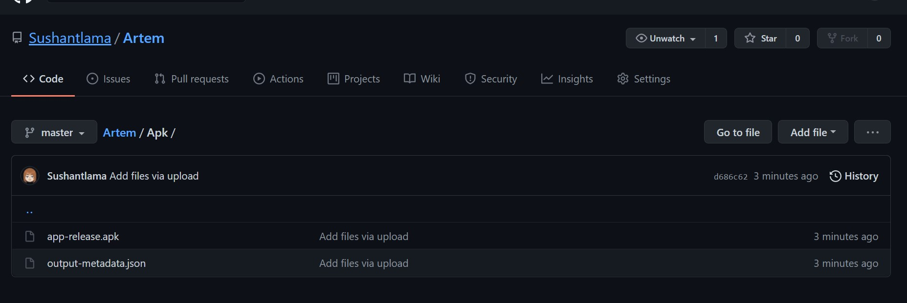 
- download the app-release.apk file
- if using any device except android move the file to your android device (ex :- share through WhatsApp)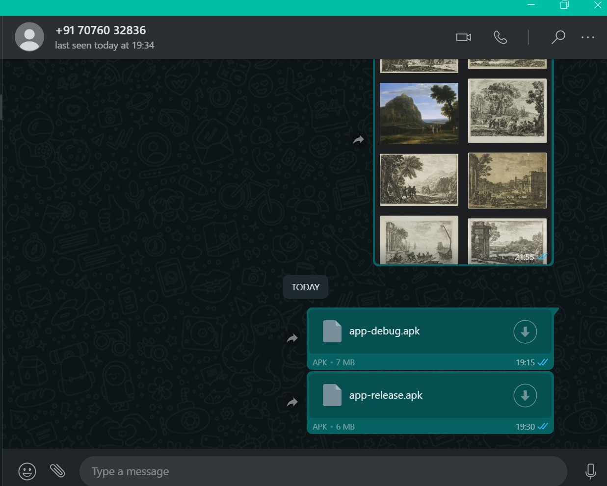
- find the apk file in the file explorer of your android device
   
  <table>
  <tr>
    <td>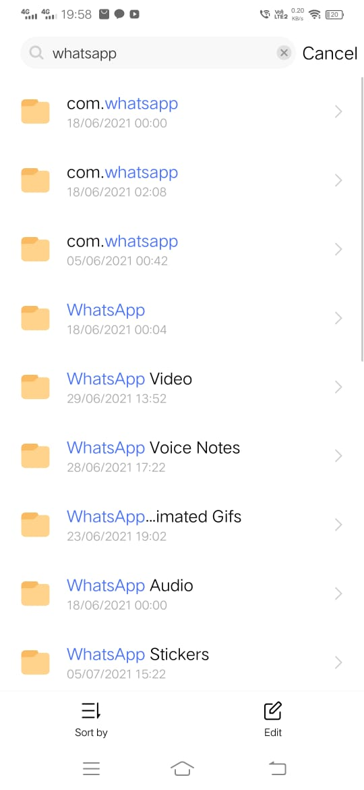</td>
    <td>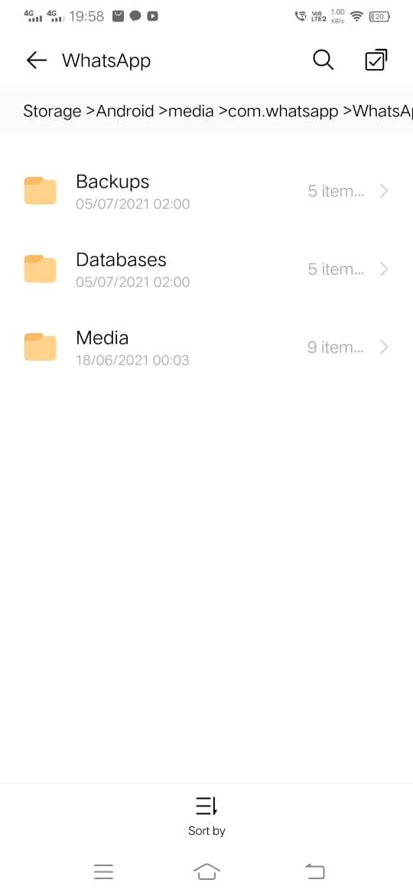</td>
    <td>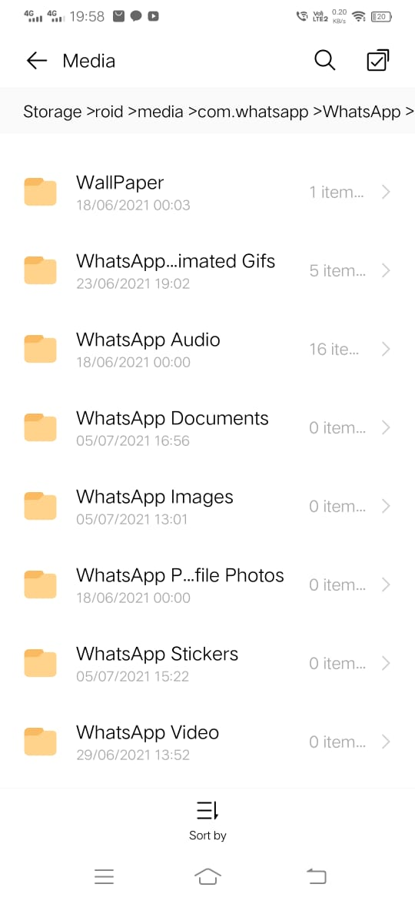</td>
    <td>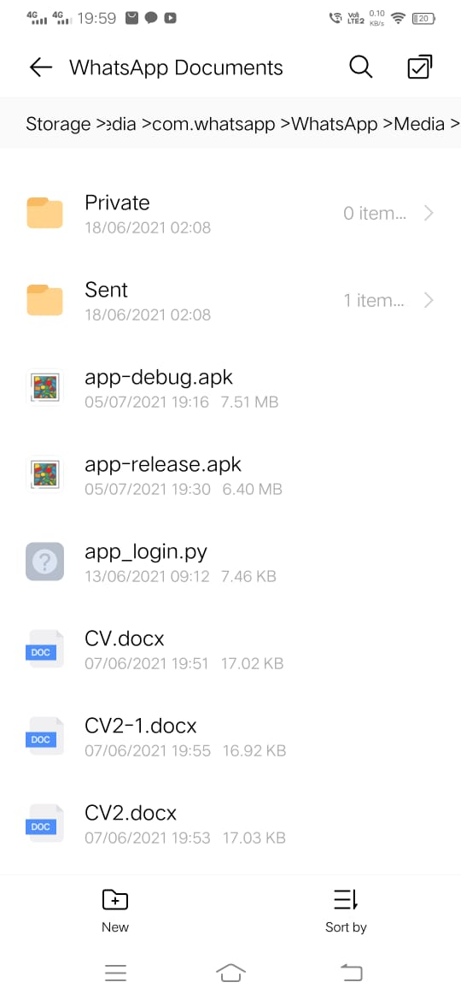</td>
    <td>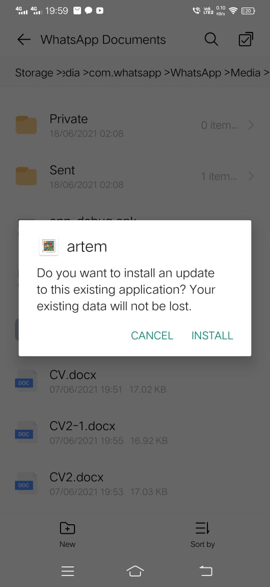</td>  
    <td>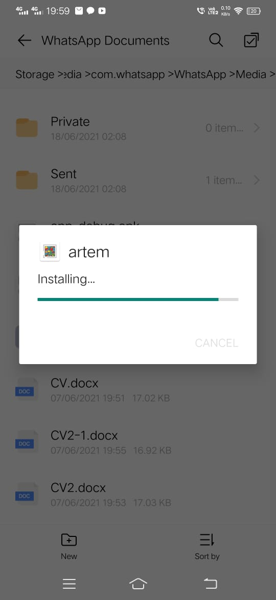</td>
  </tr>
 </table>
   
- Install it
# Screenshots
 
<table>
  <tr>
    <td>Artworks screen Page</td>
     <td>Artworks item page</td>
     <td>Artist Screen Page</td>
    <td>Artist Picasso Page</td>
    <td>Search Image Page</td>
    <td>User Info Page</td>
  </tr>
  <tr>
    <td>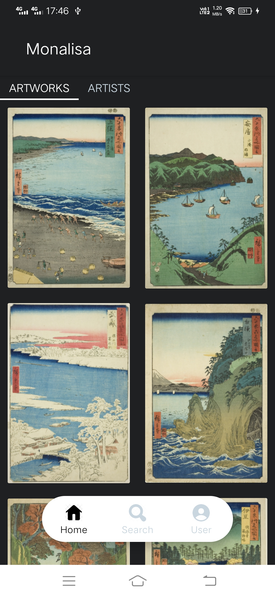</td>
    <td>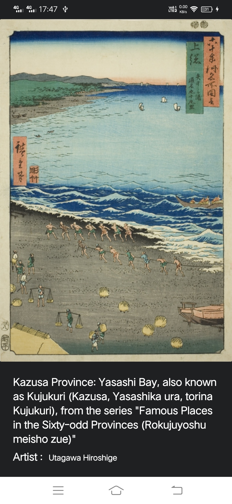</td>
    <td>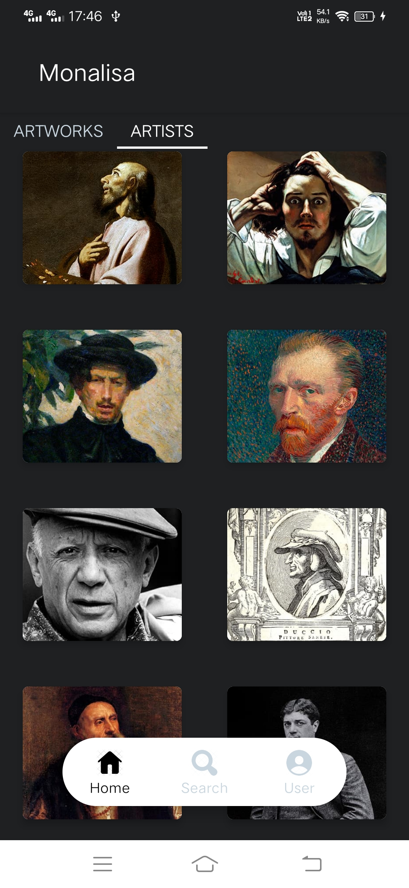</td>
    <td>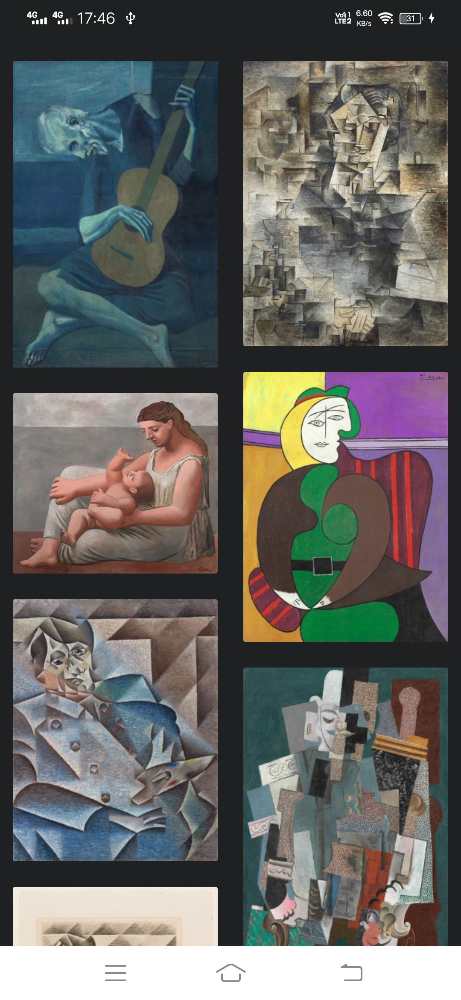</td>
    <td>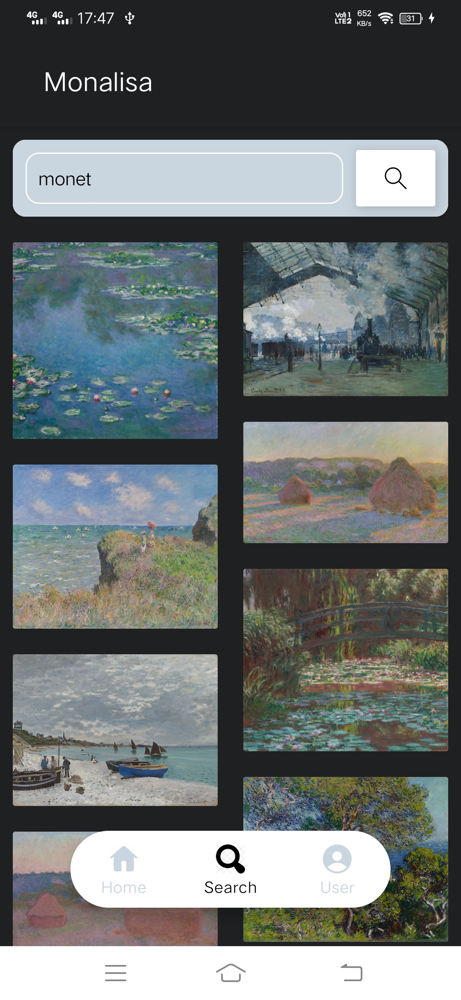</td>  
    <td>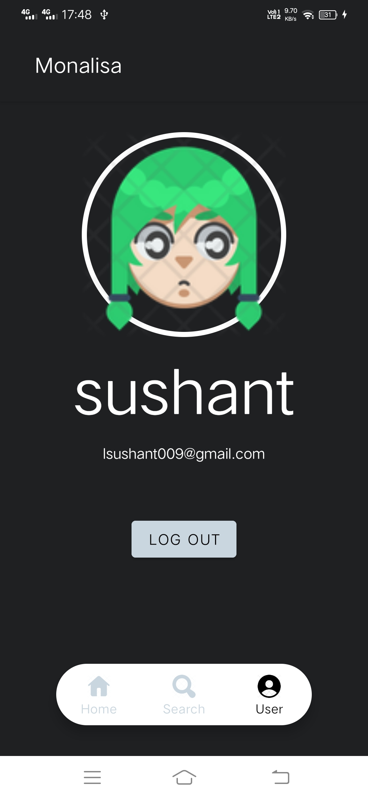</td>
  </tr>
 </table>
  
 

